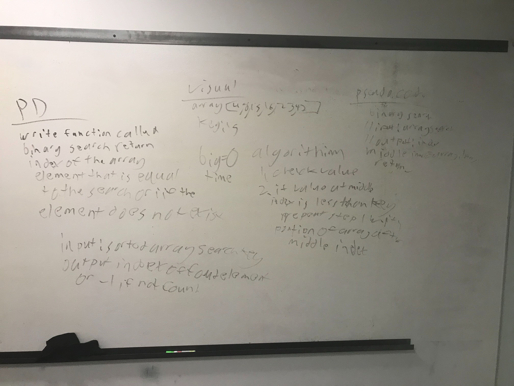

# Binary Search
Write a function which takes in 2 parameters: a sorted array and the search key. Without utilizing built-in methods return the index of the array’s element that is equal to the search key, or -1 if the element does not exist.

## challenge
taking in arrays and sort through to find the same match key

## Approach and Efficiency
Doing everything on white board then talking it out and exchanging ideas

