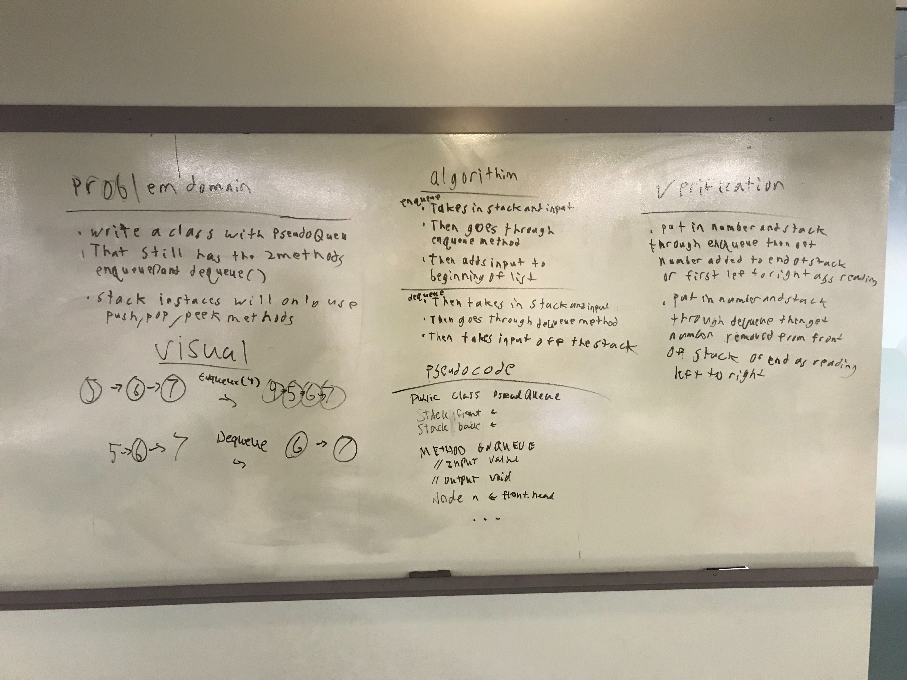

# pseudoqueue code challenge 11
Build multiple classes to add and remove cats to certain shelters and return null if not cat or dog
## challenge
Putting together multiple classes then only adding dog or cat to them and be able to remove them also and keep out other types of animals
## Approach and Efficiency
Going to create one method at a time and work little by little with testing so im not doing what I did in the past and create multiple methods and then test and realizing It didnt work from the beginning and I need to start over.
