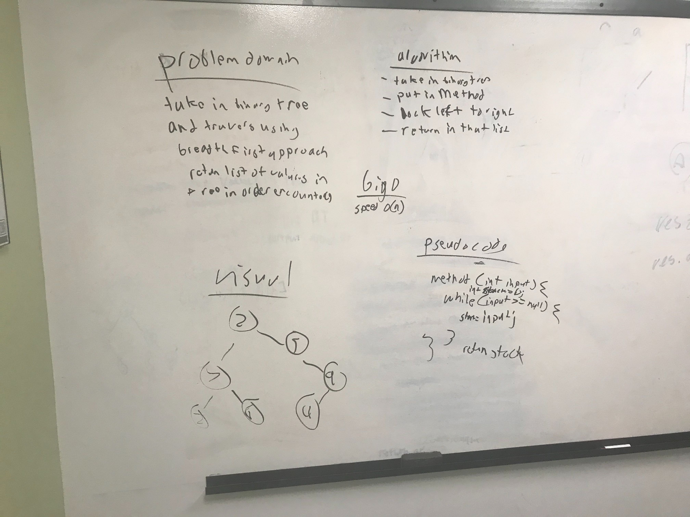

# code challenge 17
build a method that will traverse a binary tree with what it encounters first and puts in sthack
## challenge
Going from left to right in that order and putting things in a new stack
## Approach and Efficiency
Going to create one method at a time and work little by little with testing so im not doing what I did in the past and create multiple methods and then test and realizing It didnt work from the beginning and I need to start over.
