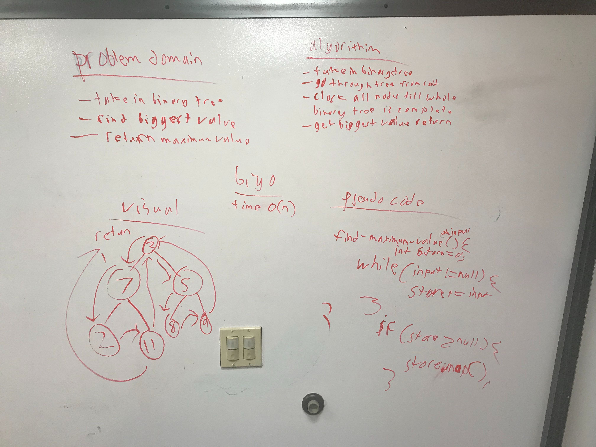

# code challenge 18
search entire binary tree to find biggest value
## challenge
search binary tree and put into new stack and find biggest one
## Approach and Efficiency
Going to create one method at a time and work little by little with testing so im not doing what I did in the past and create multiple methods and then test and realizing It didnt work from the beginning and I need to start over.
