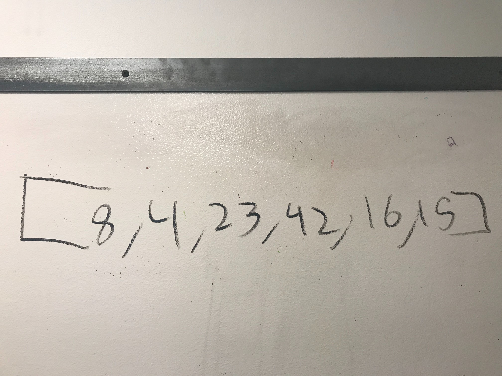
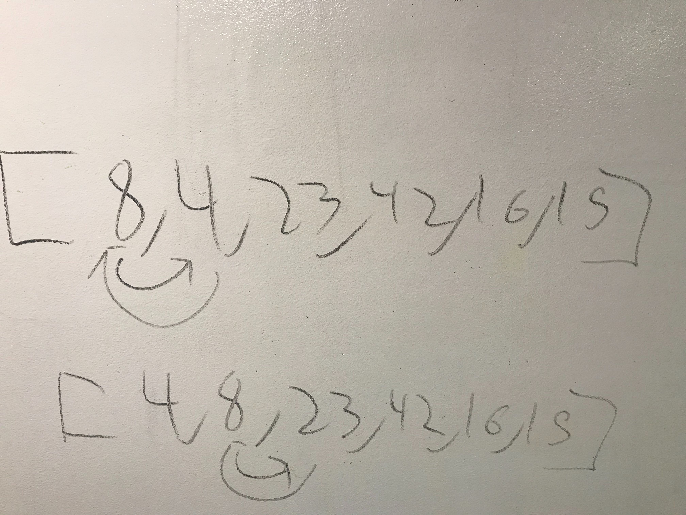
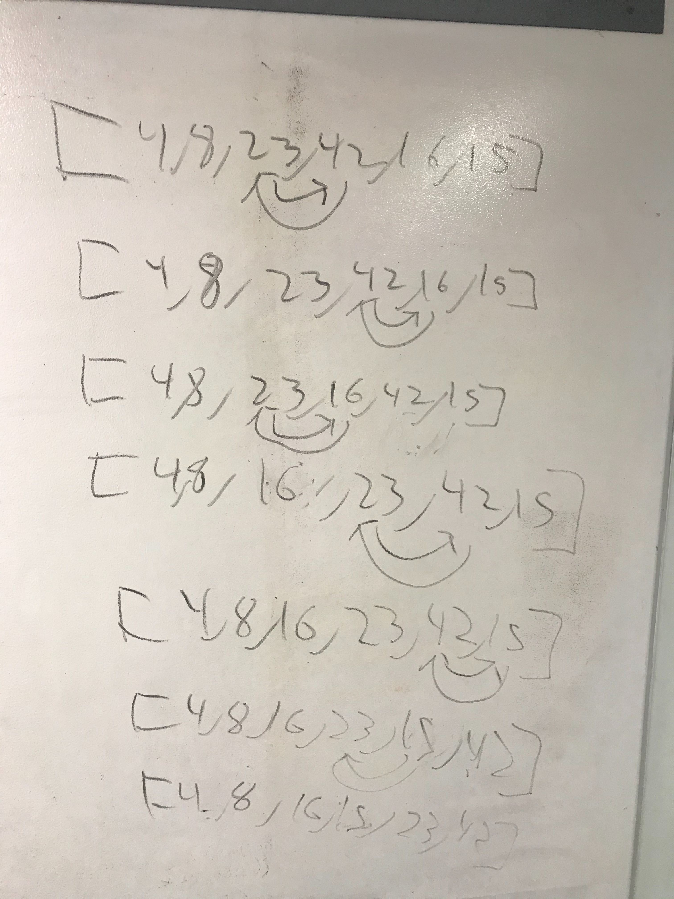
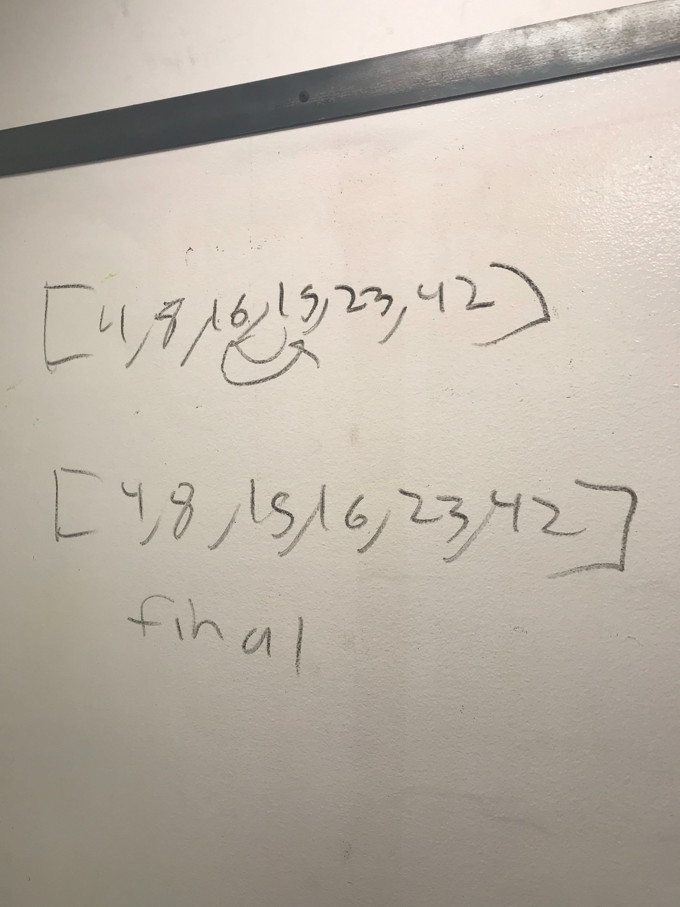

# code challenge 26

## challenge
Take in a array and return array in order

##pic 1
Take in a array 

##pic 2
Start going through the array noticed how the first 2 at a time compare each other

##pic 3
As you look down the line it starts organizing itself constantly reach back to the beginning and not just skipping over the positions in the array it was already at it always starts at the beginning.

##pic 4
As you see the final output is it completely sorted
