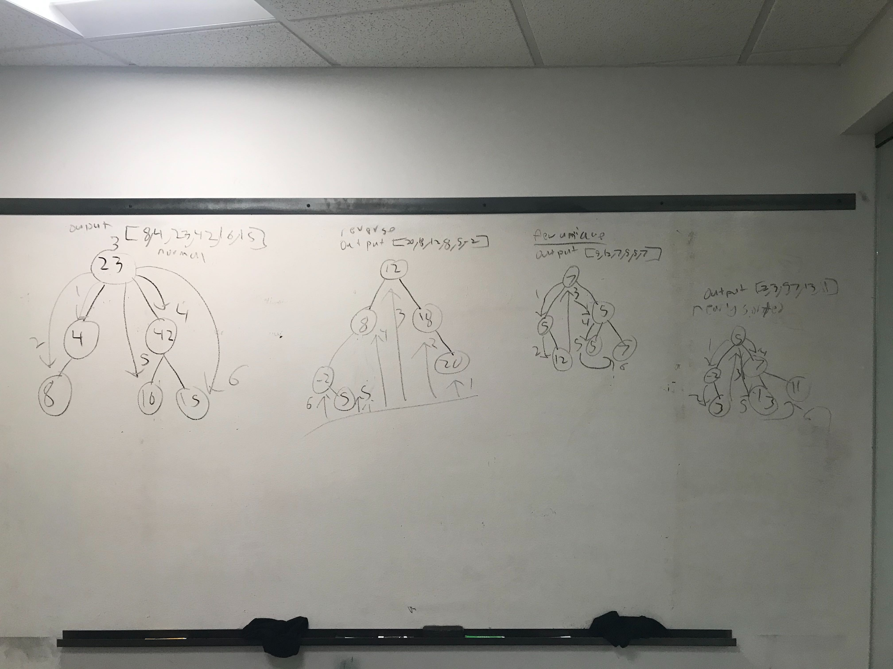
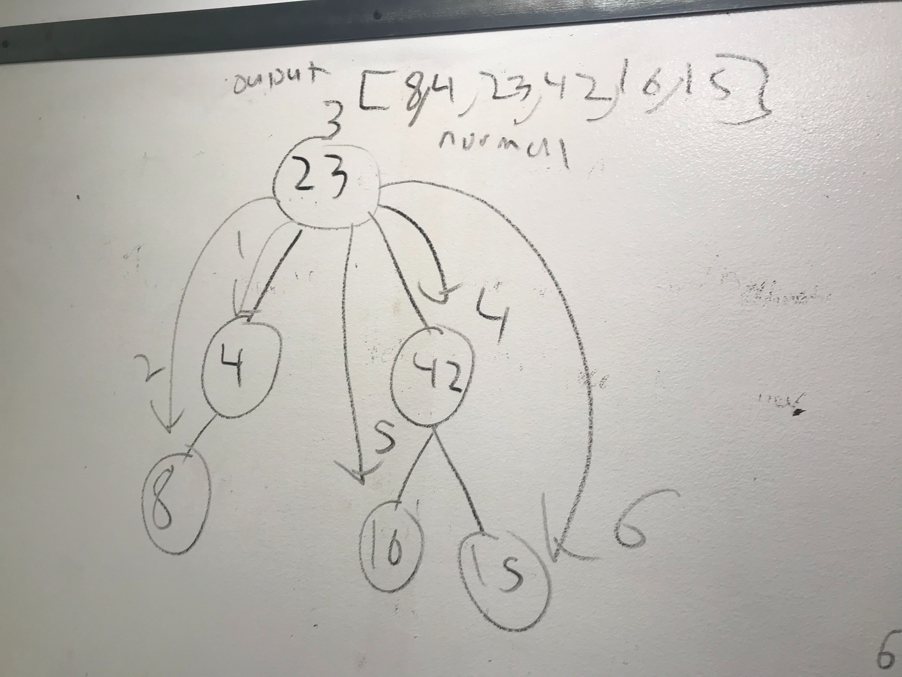
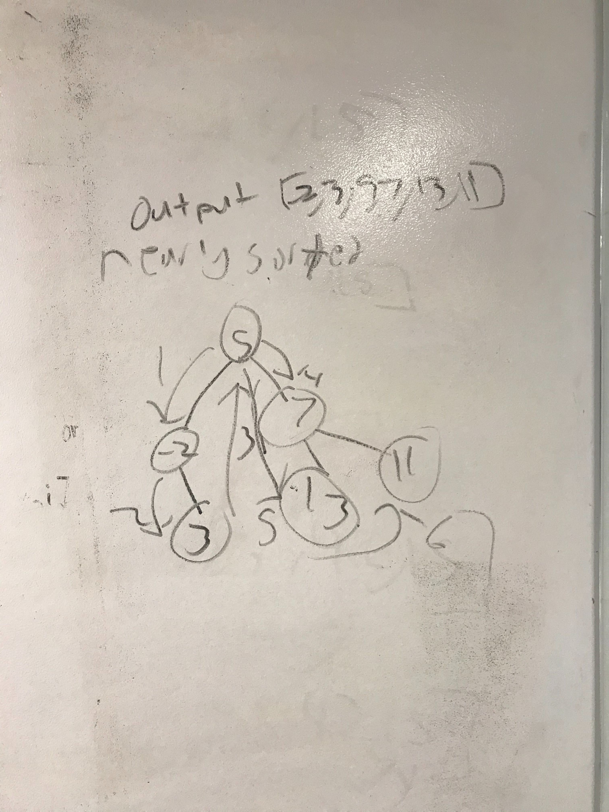
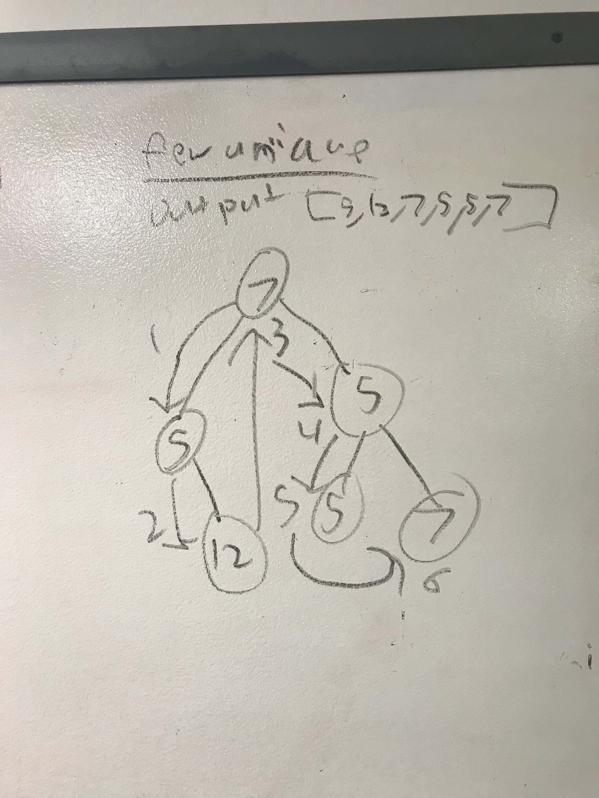
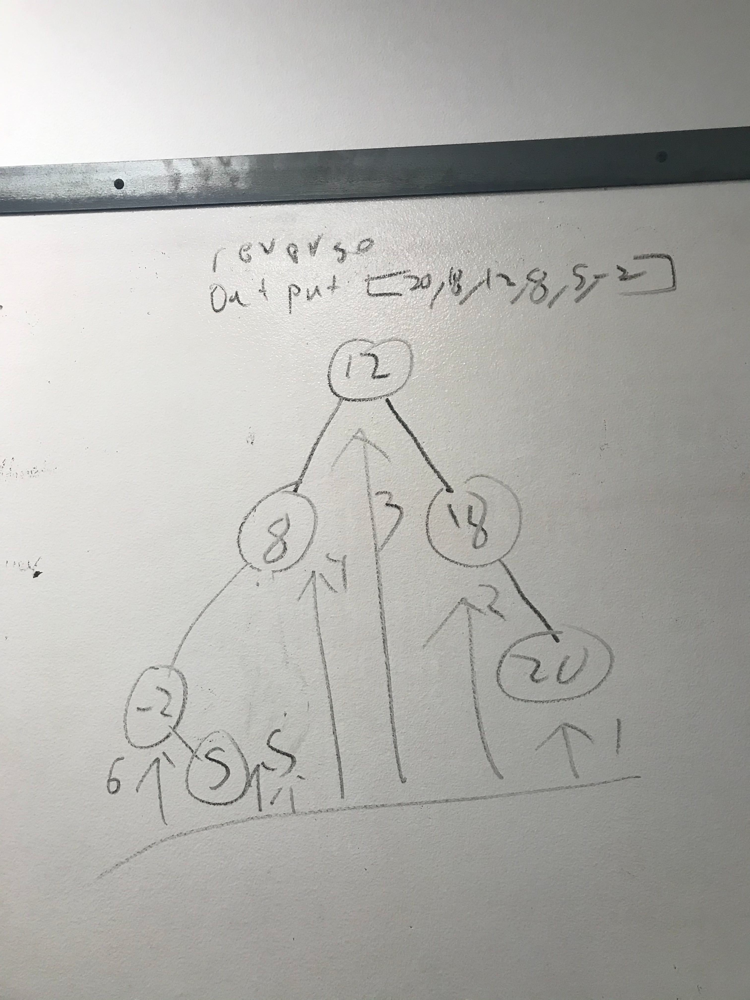

##Code challenge 26

##Challenge
Take in a node tree and arrange output in certain ways

##Normal method
Take in a binary tree and arrange it in order from root then back in fourth between left and right look at the arrows numbered with the steps.

##Nearly sorted method
Take in binary tree comes across as sorted when really its going from the base left to right look at the numbered arrows on how it reads it.

##Few unique method
As you look down the line it starts organizing itself constantly reach back to the beginning and not just skipping over the positions in the array it was already at it always starts at the beginning.

##Reverse method
Take in a binary tree and read it right to left look at how the arrows are numbered in how it reads it.
