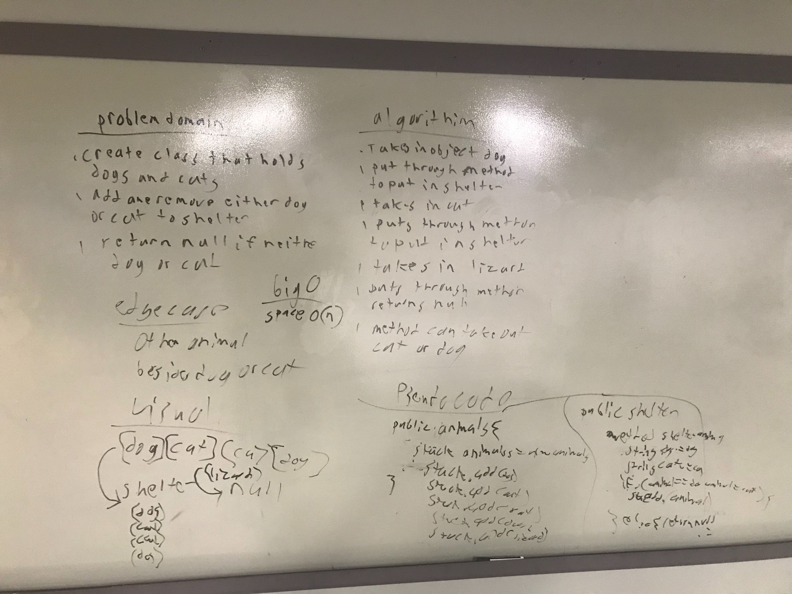

# pseudoqueue code challenge 13
take in string to check if brackets are balanced

## challenge
take in string and check if brackets are balanced and disrguard the words in the brackets have to figure out a way to return true or false with a boolean checking the strings for inputs

## Approach and Efficiency
Doing everything on white board then talking it out and exchanging ideas
using muliple monitors to easier visually see how things go back and fourth between pages. Also writing it out and drawing lines to help visually see how the information flows back and fourth
