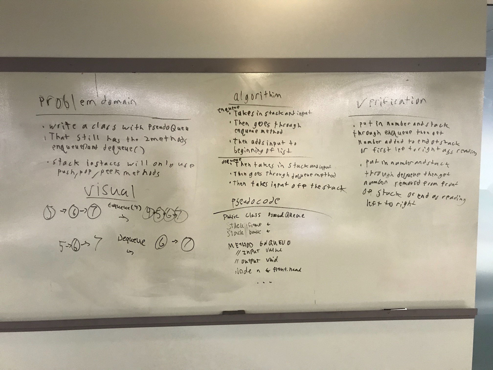

# pseudoqueue code challenge 11
write 2 methods which one will add one to the stack and the other will remove from the stack
## challenge
takes and adds at specific parts front and back
## Approach and Efficiency
Doing everything on white board then talking it out and exchanging ideas

